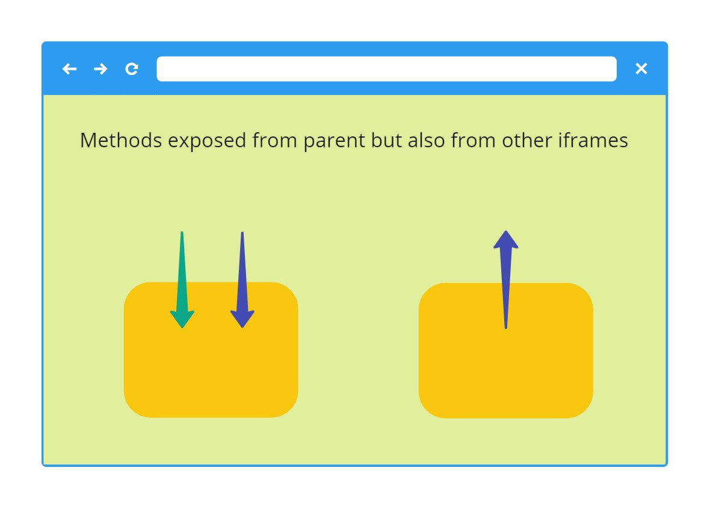

# TheHub - proof of concept project, example for web plugin system

This is an example project that shows how communication between `Window` objects could
be implemented in a way to easily expose methods to call between those objects.

In this example we have a central application to which 3rd party applications can
connect to by providing a child iframes. Those child iframes could use SDK exposed by the central 
application or expose their own methods to other child iframes via central application.

This sample project might for instance inspire you how you could create a plugin system in your application.

## How to run
Expose parent and child directory using either apache or nginx on port 8002 (parent) and 8003 (child) respetively.
Now when you open https://localhost:8002/ you should see the result of the communication.


## Idea

Iframes can communicate with each other using a method called 
[postMessage(...)](https://developer.mozilla.org/en-US/docs/Web/API/Window/postMessage)
as this is the only method that allows safe cross-origin communication between Window objects.

Requiring clients of any plugin systems to communicate using such method is problematic
as sending and receiving response would be quite complex to implement and maintain by the clients. 

The idea is to hide that complexity and be able inside the parent central application to 
 easily add new SDK methods which would be exposed to child frames, and 
 then be easily able to call those methods from child frames.
 
 Parent:
 ```javascript
function someMethod() {
    ...
}

registerFunction(someMethod);
```

Child:
```javascript
theHub.onReady(async () => {
    theHub.someMethod();
})
```


The entire communication is hidden from both the developer of the methods exposed to plugins/clients
and the client can use those methods from the parent without a need to worry to update
their javascript SDK file as those functions are loaded dynamically from the parent
each time.

## Long term vision

Such an approach could allow to also have child frames which expose their functions to parent
central application which could then expose those back to other child frames which would want to use those. That is why the project name - The Hub. 



As an example, we could imagine we have a child frame that exposes some logic,
 let's call them provider frames. We also have a client frame which would want to use that logic - let's call it client frame.
 
 Client frame would need to let *The Hub* know it wants to use logic from the given *provider frame*.
 
 If the provider frame would need an end-user authorization, then *The Hub* would have logic in place to ensure that an end-user approved client frame to use 
 provider frame.
 
 Example:
 
 ```
The user goes to one of the boards created on The Hub.
This board has 1 provider frame which exposes a method for the listing of all user projects on GitHub.
There is also 1 client frame with UI. This client frame requires to use GitHub provider frame.
User is prompt to allow client frame to use GitHub provider frame functions.
Once the user accepts, the client frame calls the project listing method exposed by the GitHub provider frame.
An end-user can be prompt for authentication to GitHub.
The end result is that user now can see on The Hub board his GitHub projects listed inside the client frame.
```

## Use cases

The idea to play around with this project was caused by the fact that quite often 
we want to try out different REST APIs or allow someone else to 
easily and fast create some projects using our REST API.

With The Hub it could be easily achievable as all that would be required would be for someone
to just create client frame and he already would be able to easily call our API 
exposed via either directly The Hub [with modifications] or provider frame which would expose those REST API methods via javascript SDK.

## Next steps ideas

1. proof of concept of working provider frames.
2. proof of concept of working provider frames which require end-user authentication
3. proof of concept of working user approvals for client frames to use provider frames

## Contribution
To contribute please create an issue with your idea and then do a pull request.

## Note
This is an experimental side project to find out how one could create a plugin system. It was open-sourced with belief that someone might find this example useful.

## License

Copyright © 2020 Ocado

Licensed under the Apache License, Version 2.0 (the "License"); you may not use this file except in compliance with the License. You may obtain a copy of the License at

http://www.apache.org/licenses/LICENSE-2.0
Unless required by applicable law or agreed to in writing, software distributed under the License is distributed on an "AS IS" BASIS, WITHOUT WARRANTIES OR CONDITIONS OF ANY KIND, either express or implied. See the License for the specific language governing permissions and limitations under the License.
